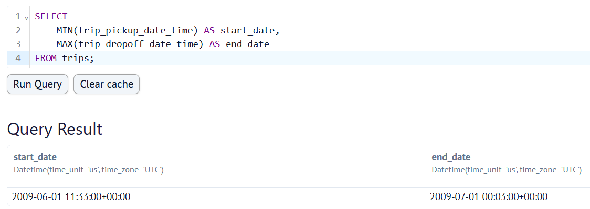
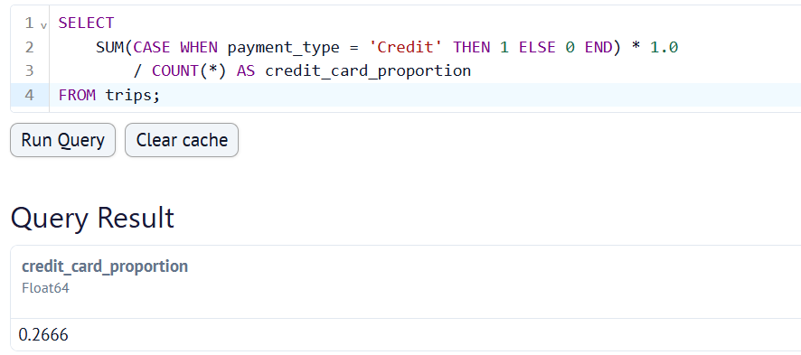
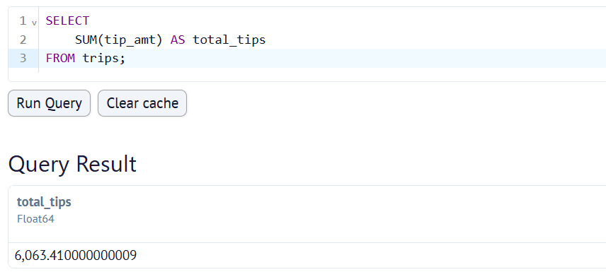

My dlt project is located at https://github.com/ak3j6l03/dlt_workshop.git.

After I set up my taxi pipeline, I run `dlt pipeline taxi_pipeline show` to create a dashboard. In the "Dataset Browser" block, I run queries to answer the following questions.

## Question 1

## Question 2

## Question 3
