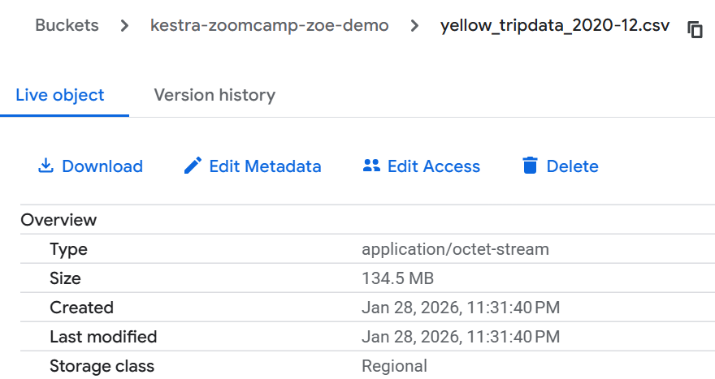
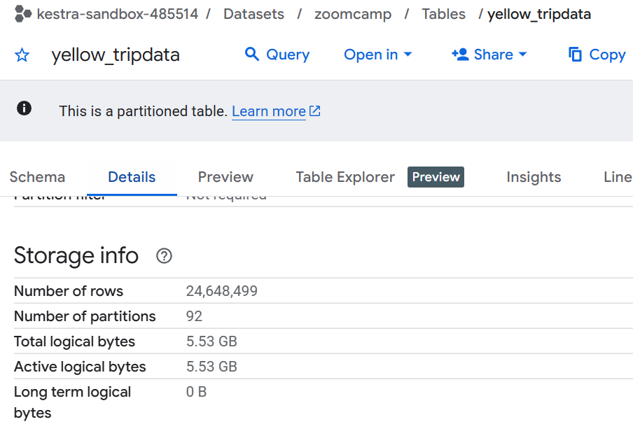
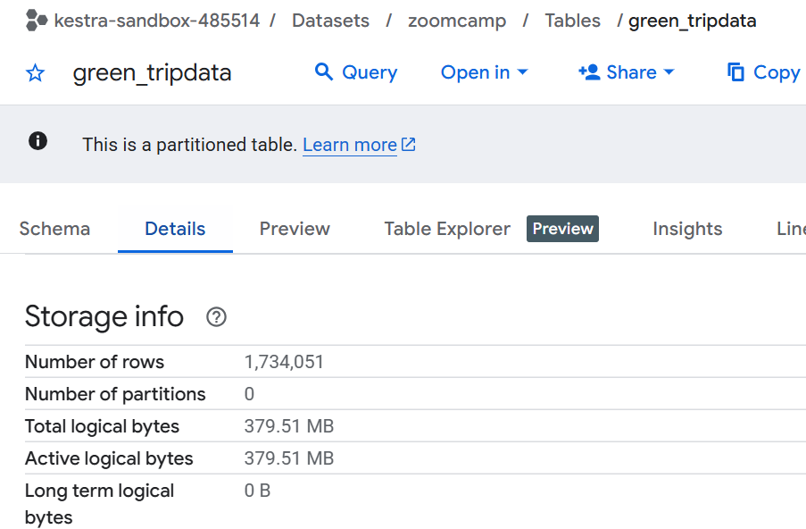
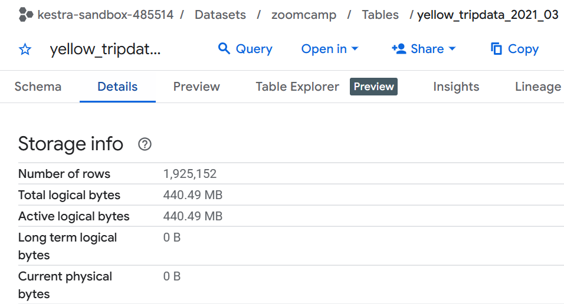

First, run the docker-compose.yaml and use Kestra to complete the assignments below.

## Question 1
I checked the bucket on GCP to see the file size of yellow_tripdata_2020-12.csv, and it says 134.5 MB.

## Question 2
Put it altogether in {{inputs.taxi}}_tripdata_{{inputs.year}}-{{inputs.month}}.csv, it's green_tripdata_2020-04.csv.

## Question 3 to 4
I used backfills to extract all the data for 2020 for both yellow and green taxis. Then I checked the merged table rows in GCP BigQuery.

## Question 5
I manually ran the extraction of yellow taxi data for March 2021, and then checked the table rows in GCP BigQuery.

## Question 6
Add the timezone property like this:  
id: my-schedule  
type: io.kestra.core.models.triggers.types.Schedule  
cron: "0 6 * * *"  # 6:00 AM in New York  
timezone: "America/New_York"  