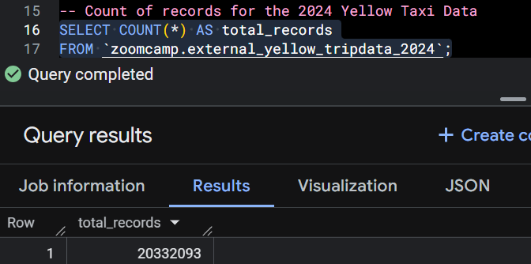
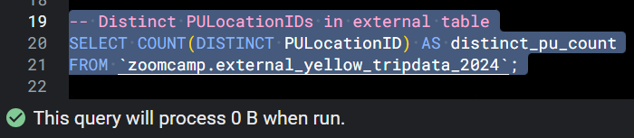
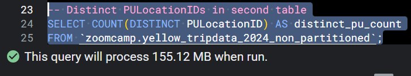
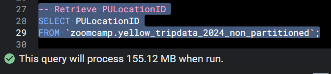
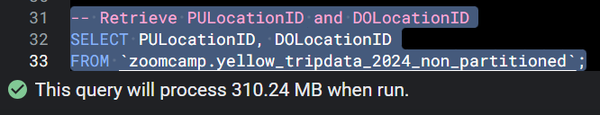
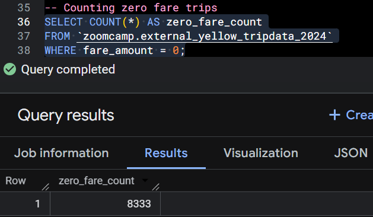
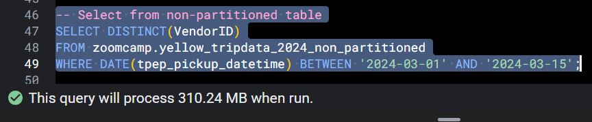
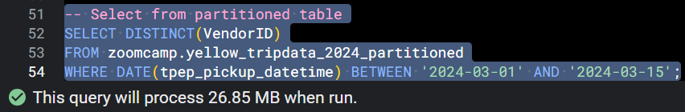

First, run load_yellow_taxi_data.py to upload the Parquet files to my GCP bucket. Write queries to answer the following questions. Queries are stored in big_query.sql.

## Question 1

## Question 2
For external table, it's 0 MB.

For non-partitioned table, it's 155.12 MB.

## Question 3 

1. Correct
2. BigQuery doesn’t scan the table twice just because you select more columns.
3. Caching doesn’t affect the estimated bytes scanned in the query plan.
4. Columns in the same table are not joined; they are stored together column-wise.

## Question 4

## Question 5
Partition by tpep_dropoff_datetime and Cluster on VendorID

Partitioning:
BigQuery splits the table into separate segments by a column (usually a date or timestamp).
Filtering on the partition column only scans the relevant partitions, reducing bytes read and query cost.

Clustering:
Clustering sorts the data within each partition based on one or more columns (like VendorID).
Helps efficiently filter or order by that column inside the partitions.

## Question 6
For non-partitioned table, it's 310.24 MB.

For partitioned table, it's 26.85 MB.

## Question 7
The data is stored in Google Cloud Storage (GCS).

## Question 8
False

Clustering is useful when:  
You frequently filter, group, or order by specific columns. Example: VendorID in taxi data, customer_id in sales data.  
The table is large enough that clustering will improve performance and reduce scanned bytes.

When clustering is not needed:  
For small tables, clustering adds overhead without much benefit.
If your queries don’t filter or order by specific columns, clustering won’t help.
Tables that are append-only and queried randomly may not benefit much.