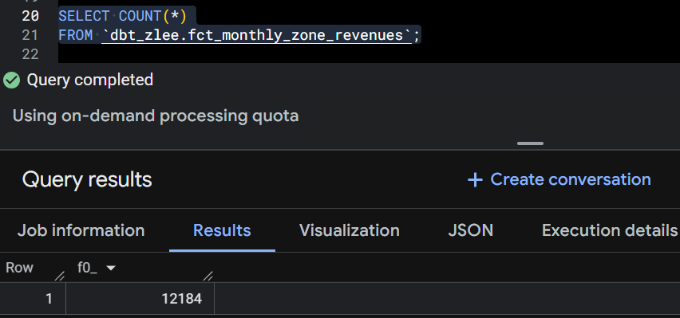
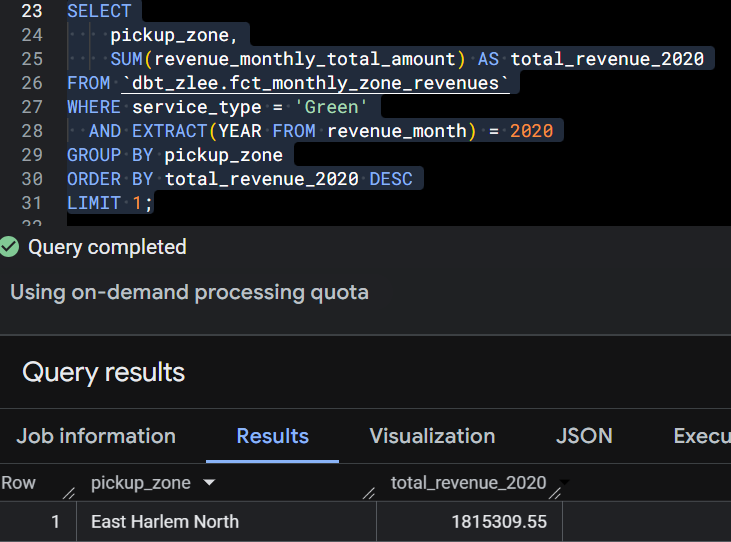
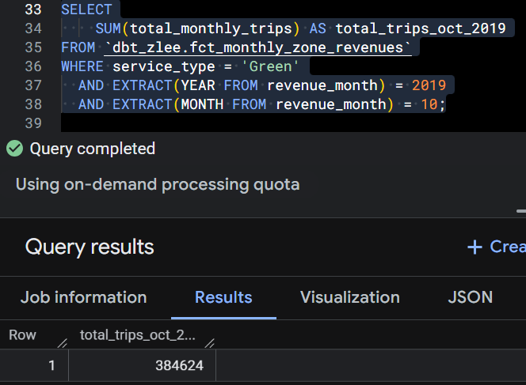
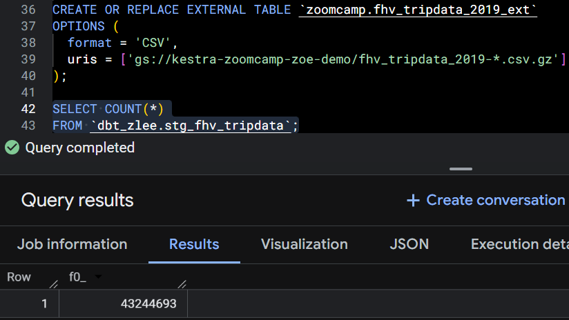

First, run load_yellow_taxi_data.py to upload the csv.gz files to my GCP bucket. Then, start a dbt project and write queries to answer the following questions. My dbt project is located at https://github.com/ak3j6l03/dbt-workshop.git.

## Question 1
dbt automatically builds all upstream dependencies of the selected model.  
It does not build downstream models unless you explicitly use `--select +model_name` for downstream.

So the answer is "stg_green_tripdata, stg_yellow_tripdata, and int_trips_unioned (upstream dependencies)".

## Question 2
dbt will fail the test, returning a non-zero exit code

Generic tests always validate the data, not the model change.  
Any new unexpected values will trigger test failures until you update the accepted values list.

## Question 3

## Question 4

## Question 5

## Question 6
