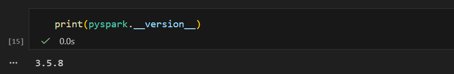
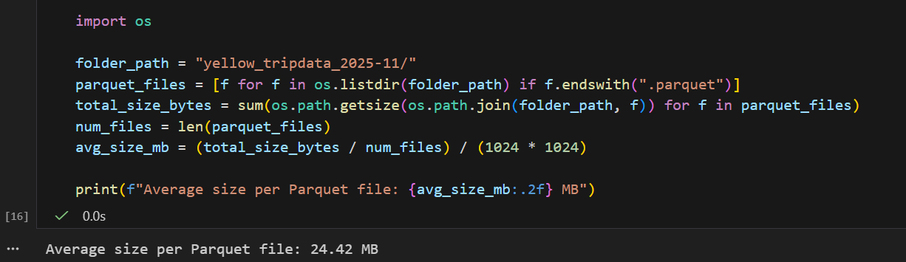
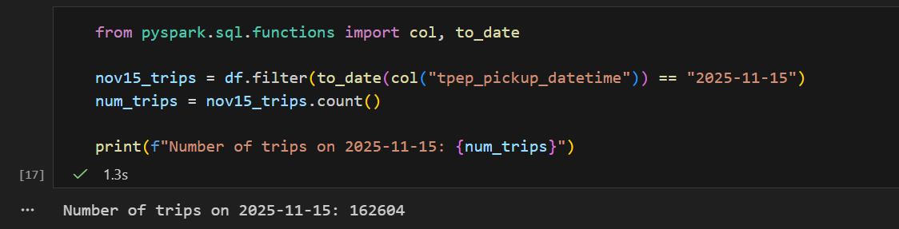
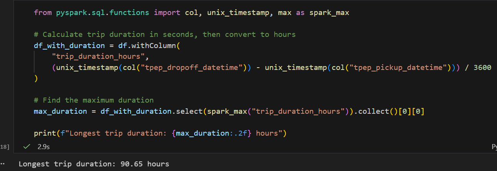
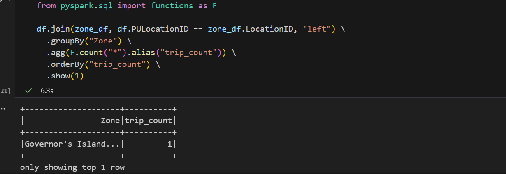

My code is located at `homework06/pyspark.ipynb`.

## Question 1

## Question 2

## Question 3

## Question 4

## Question 5
By default, Spark’s web UI (dashboard) runs on port 4040 on local machine.

## Question 6
