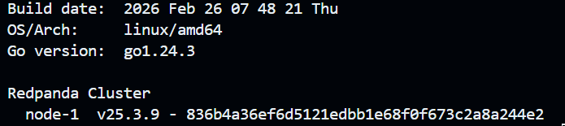
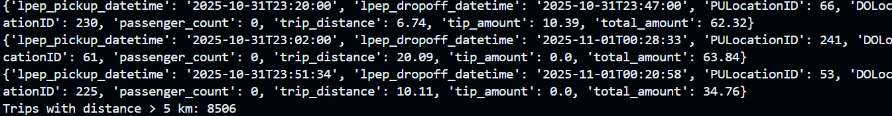
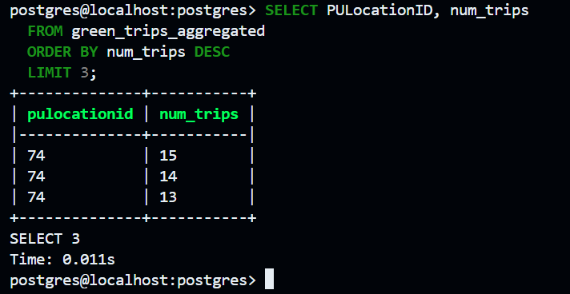
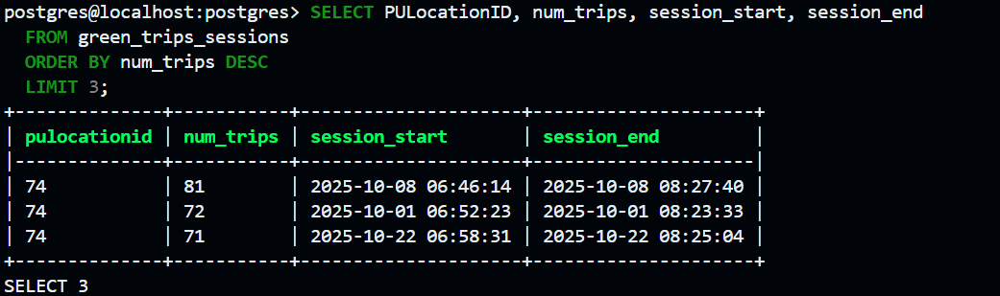
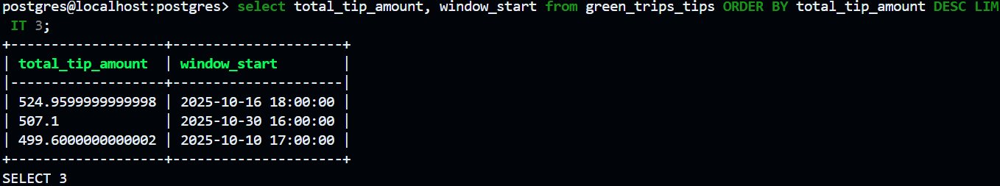

## Steps in q4
``` bash
uv init -p 3.12
uv add kafka-python pandas pyarrow

docker compose build
docker compose up -d

docker exec -it pyflink-workshop-redpanda-1 rpk topic create green-trips

uv run python src/producers/producer.py

uvx pgcli -h localhost -p 5432 -U postgres -d postgres

CREATE TABLE green_trips_aggregated (
    window_start TIMESTAMP,
    pulocationid INTEGER,
    num_trips BIGINT,
    PRIMARY KEY (window_start, pulocationid)
);

docker compose exec jobmanager ./bin/flink run \
-py /opt/src/job/pickup_location.py \
--pyFiles /opt/src -d
```

## Question 1


## Question 2


## Question 3


## Question 4


## Question 5


## Question 6
